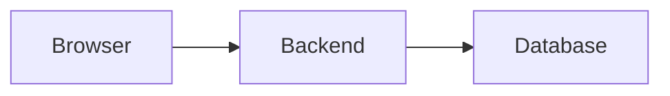

# Engineering Blog Writer

Use this skill when creating or revising articles for Goatveloper.

The goal is to turn real software work into clear, practical engineering writing. The article should make the author look thoughtful, technically serious, and honest about tradeoffs without sounding corporate, generic, or AI-generated.

## Repository Conventions

- Articles live in `src/content/articles/`.
- Prefer Markdown for normal articles and MDX only when a post needs custom components.
- Existing posts may use `.mdx`; match nearby conventions when appropriate.
- Use the content collection frontmatter shape:

```md
---
title: "Article Title"
description: "Short practical description."
pubDate: 2026-08-10
updatedDate: 2026-08-10
tags: ["architecture", "backend"]
series: "Senior Engineering Cases"
featured: false
draft: true
---
```

- Use `draft: true` for new unfinished posts unless the user explicitly asks to publish.
- Keep tags lowercase and useful for navigation.
- Use `series: "Senior Engineering Cases"` for practical case studies about implementation decisions.

## Editorial Voice

Write with a voice that is:

- clear
- direct
- human
- specific
- quietly confident
- honest about uncertainty and tradeoffs

Prefer sentences like:

- "That is the product story. The systems story is different."
- "This is not security. It is user experience."
- "The interesting part is not the API call. It is the boundary."
- "The code is not trying to be fancy. It is choosing the least surprising failure mode."

Avoid:

- generic tutorial voice
- marketing language
- hype about scalability, robustness, or modernity without specifics
- exaggerated certainty
- empty summaries
- invented project details
- pretending a tradeoff does not exist

## Article Shape

For implementation-based articles, use this structure as a default:

1. **Concrete opening**: start with the small feature or decision that triggered the lesson.
2. **The mental shift**: explain what a junior/simple implementation might miss.
3. **Boundaries**: separate frontend, backend, database, external systems, security, and operational responsibilities.
4. **The chosen design**: explain the architecture in plain language before code.
5. **Tradeoffs**: include what the design enables and what it does not solve.
6. **Tests or verification**: describe how the important promises should be protected.
7. **Practical checklist**: give readers a reusable list.
8. **The bigger lesson**: close with the engineering principle, not just the implementation detail.

Do not force every article to use every section. Keep the structure useful, not mechanical.

## Length And Density

Goatveloper articles should be dense, polished, and easy to finish. Prefer fewer words with more signal.

Default length targets:

- **Target range**: 1,200-1,800 words for most articles.
- **Soft maximum**: 2,000 words.
- **Hard maximum**: 2,200 words unless the user explicitly approves a longer deep dive.
- **Short architecture note**: 800-1,200 words when the idea is narrow.

Section constraints:

- Keep the opening under 180 words.
- Prefer 5-8 main sections.
- Keep most sections between 120 and 250 words.
- Use at most one practical checklist, usually 6-8 items.
- Use code or schema examples sparingly; 1-3 small examples are usually enough.
- Remove repeated explanations. If a sentence restates a previous point without adding precision, cut it.

Compression rules:

- Keep the sharpest example and delete weaker variants.
- Prefer one concrete tradeoff over three generic caveats.
- Replace long definitions with short explanations plus a small example.
- Use headings to carry meaning so the prose can stay shorter.
- End sections on a useful insight, not a summary of what was just said.

If the first draft exceeds the soft maximum, do a condensation pass before presenting it as complete.

## Visual Support

Use visual thinking to make articles easier to understand, but do not add decorative images.

Prefer visuals that explain architecture or tradeoffs:

- small flow diagrams
- before/after diagrams
- data-shape sketches
- trust-boundary diagrams
- sequence diagrams
- one annotated screenshot when the article is about UI or tooling

Use Mermaid for diagrams that can be expressed as code. Prefer `flowchart` for boundaries and ownership, and `sequenceDiagram` for request flows or failure paths:

````md

````

Keep diagrams small enough to understand at a glance. A useful Mermaid diagram usually has 4-8 nodes. If the diagram needs more than 10 nodes, split it or simplify the article section.

When the final asset does not exist yet, include an **illustration plan** in the response to the user rather than noisy placeholders in the article body. Keep each suggestion concrete:

```md
Illustration idea: A two-column diagram showing `phone_ciphertext` for storage and `phone_blind_index` for lookup, with arrows from backend normalization to each column.
```

For drafts, ASCII-style diagrams in code blocks are acceptable when they carry technical meaning:

```text
input -> normalize -> encrypt      -> phone_ciphertext
                   -> HMAC(index)  -> phone_blind_index
```

Avoid stock imagery, vague hero images, decorative gradients, or diagrams that merely repeat the title.

## Security And Privacy Writing Rules

When writing about security-sensitive implementation details:

- Separate what the design protects from what it does not protect.
- Name leakage honestly. For example, blind indexes still reveal equality for identical normalized inputs.
- Prefer conceptual examples over production-ready cryptographic code unless the user asks for implementation.
- Do not include secrets, credentials, real customer data, tokens, or environment values.
- Do not invent compliance claims. Say a pattern is compatible with stricter PII handling only when the article also names the remaining operational requirements.
- Emphasize key management, access control, logging, rotation, and least privilege as part of the system, not afterthoughts.

## Fact Handling

- Treat user-provided project details as source material.
- If a detail is not confirmed, write it as a general pattern instead of a claim about the project.
- If the article refers to another repo, do not read that repo unless the user asks and grants scope.
- If library/API behavior matters, use Context7 or official docs before writing specifics.

## Draft Checklist

Before calling an article draft complete, verify:

- The first paragraph introduces a concrete engineering problem.
- The article has one strong thesis.
- The implementation details support that thesis.
- The tradeoffs are explicit.
- The draft stays within the default length target or has a clear reason not to.
- The article uses examples and diagrams only where they increase clarity.
- The title and description are specific.
- The closing lesson is reusable beyond the original project.
- The frontmatter satisfies `src/content.config.ts`.
- The post is marked `draft: true` unless publishing was requested.
