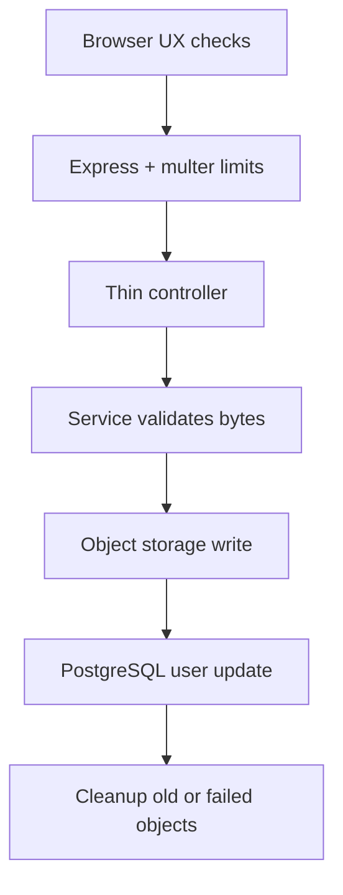
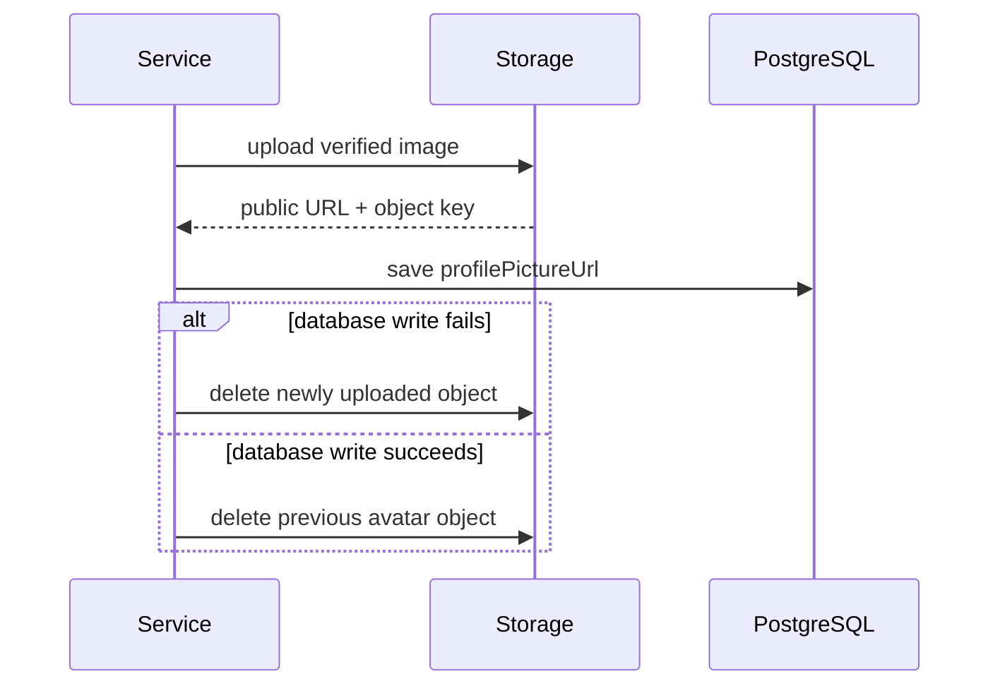

A profile picture upload sounds small.

Pick a file. Send it to the backend. Store it somewhere. Save the URL on the user. Show the new avatar.

That is the product story. The systems story is different.

In a real codebase, this feature touches the browser, an Express route, multer, backend validation, object storage, URL generation, MikroORM, PostgreSQL, and frontend state. None of those pieces share one transaction. Some can succeed while another fails.

That is where a file upload stops being just a file upload. It becomes a small distributed system.

## The Mental Shift

The happy path is easy:

1. Accept the uploaded file.
2. Store it.
3. Save the URL.
4. Return the updated user.

That path matters, but it is not the design.

The design is deciding what each boundary is allowed to promise. The browser can help the user avoid an obvious mistake. It cannot be trusted. The route can enforce request shape and coarse limits. It cannot prove the bytes are safe. Object storage can persist the file. PostgreSQL can persist the user record. They do not commit together.

The upload flow is really a chain of boundaries:

The hard part is not sending bytes. It is keeping those systems from disagreeing in surprising ways.

## The Browser Is Not The Trust Boundary

The flow starts in the profile screen.

The frontend checks the selected file before sending it. It accepts JPEG and PNG values, enforces a 2MB limit, appends the file to `FormData` under the `picture` field, and updates frontend state after the API succeeds.

That is good product behavior. It gives fast feedback and avoids wasting requests when the file is obviously wrong.

It is not security.

Anything that runs in the browser is part of the user experience boundary. A user can bypass the React component, craft a request, and send different bytes. The backend still has to assume the upload is untrusted.

This distinction keeps the architecture honest. The UI can help. The backend owns the guarantee.

## Express And Multer Shape The Request

The backend route uses `multer.memoryStorage()` for the profile picture endpoint.

That choice is only reasonable because the route also applies strict limits: one file, 2MB, and a MIME filter for JPEG and PNG uploads. The route is protected by authentication and expects a single `picture` field.

This boundary is about HTTP mechanics.

Multer can reject too many files, oversized files, and obvious MIME mismatches before the service runs. But MIME is still request metadata. It can be wrong.

So the route should not pretend to be the final authority on whether the upload is an image. It should pass a small, well-shaped input to the service and stop there.

Thin controllers are not just style. In a flow that crosses systems, they keep coordination logic in one place where it can be tested without an HTTP server.

## The Service Verifies Bytes

The real upload policy sits in the service layer.

The service checks MIME type and size again, then inspects the file signature. PNG files must start with PNG magic bytes. JPEG files must start with the JPEG signature.

This is the trust boundary.

The service does not accept a file as an image because the browser said so. It does not accept it because the multipart metadata said so. It verifies the bytes before asking storage to keep them.

That may sound like a security detail, but it is also a systems detail. Invalid data that crosses a boundary becomes harder to reason about later. Once an object is stored and a URL is persisted, the mistake has spread.

Good distributed systems design often starts by refusing to distribute invalid state.

## Storage And PostgreSQL Do Not Roll Back Together

After validation, the service uploads the file to S3-compatible storage and receives a public URL. If a CloudFront domain is configured, the URL uses that domain. Otherwise it falls back to the S3 public URL shape.

For profile pictures, the key includes the user id and a timestamp. That timestamp matters because each upload gets a new public URL, which avoids stale cached avatars.

Then the service writes the new URL to PostgreSQL through MikroORM.

This is where the distributed systems problem becomes visible.

The object may already exist while the database write has not succeeded. There is no single transaction covering object storage and PostgreSQL. If the database flush fails, the app cannot pretend nothing happened. Something did happen: a new object was stored.

The service handles that with compensating cleanup.

That cleanup is not a magic rollback. It is a best effort action that brings storage back in line with the database record.

## Replacing The Old Avatar

Replacement has a second rule: do not delete the old avatar too early.

Before assigning the new URL, the service keeps the previous `profilePictureUrl`. If the database flush succeeds, it extracts the old storage key and deletes the previous object afterward.

The timing matters.

Deleting the old avatar before the database write creates a bad failure mode. If the old object is gone and PostgreSQL rejects the new URL, the user record may still point to an image that no longer exists.

The safer order is:

1. Keep the old valid state until the new state is durable.
2. If upload succeeds but database persistence fails, delete the new object.
3. If database persistence succeeds, delete the old object.

The code is not trying to be fancy. It is choosing the least surprising failure mode.

## Tests That Protect The Promise

The tests should protect the contract, not every implementation detail.

The important cases are:

1. Reject spoofed image MIME when the bytes are not an image.
2. Upload a valid image and save the new URL.
3. Delete the old avatar only after the new database state is durable.
4. Delete the newly uploaded object if database persistence fails.

Those tests describe the system promise:

We do not store fake images. We do not delete old valid state too early. We do not leave a newly uploaded object behind when the database write fails.

That is the test suite you want around a feature that crosses systems.

## The Practical Checklist

For another upload feature, I would start here:

1. Use browser validation for feedback, not trust.
2. Match the `FormData` field name with the backend route.
3. Enforce file count and size limits before business logic.
4. Treat MIME as a hint and verify bytes in the service layer.
5. Keep controllers thin.
6. Hide object storage behind a small service.
7. Decide which database record is the source of truth.
8. Handle storage success plus database failure with explicit cleanup.

## The Bigger Lesson

Distributed systems are not only queues, streams, and large clusters.

Sometimes they are a profile picture upload.

The moment one user action changes state in more than one system, you have to think about boundaries, ownership, trust, and partial failure. The useful question is not only, "How do I upload this file?"

It is, "After this request finishes, which systems believe what, and what happens if they disagree?"
