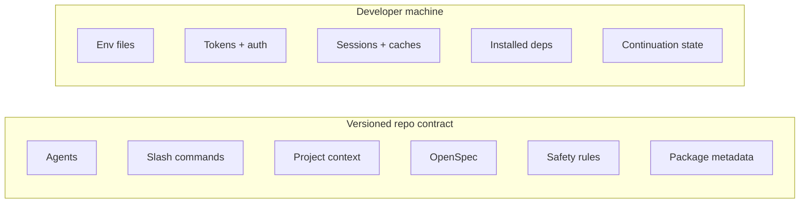

AI tooling starts as personal setup.

One developer installs a CLI. Another writes a few slash commands. Someone adds agents, connects MCP servers, stores helpful prompts nearby, and builds a workflow that works on their machine.

That is fine until the repository starts depending on those choices.

At that point, the question changes. It is no longer, "How do I make my AI workspace comfortable?" It becomes, "How do we give every developer the same useful AI-assisted environment without sharing private identity, session state, or generated files?"

This article is a proof of concept from URadar. The work was not about product behavior. It was about making the repo describe how AI assistance should be used, verified, and bounded.

## The Problem With Personal Tooling

Personal AI setup creates invisible process.

If one developer has the right agents, context files, safety commands, and specs, that developer can move quickly. The next developer may start from scratch, copy stale prompts, or ask the model to work without the project rules that made the first workflow safe.

Nothing obvious fails. There is no red test. No broken build.

The team pays through repeated setup, uneven review quality, inconsistent AI output, and missing context in generated code.

The proof of concept treated AI workspace setup as a repository concern:

1. Shared behavior belongs in git.
2. Local identity stays on the developer's machine.
3. The boundary should be documented, not implied.
4. Verification should test that boundary.

That framing keeps the setup useful without turning the repository into a dump of local machine state.

## The Boundary

The useful files and the dangerous files often live near each other.

The repo should version shared behavior: agents, commands, project context, specs, safety rules, and package metadata for repo-local tooling.

The developer machine should own identity and execution state: tokens, OAuth state, sessions, caches, local dependencies, environment files, and continuation history.

The boundary looks like this:



The value is not only convenience. It is consistency.

If an agent writes backend code, it should receive the same architecture rules no matter who runs it. If a slash command checks repo status, the team should share the same command. If OpenSpec defines how larger changes are proposed, AI-assisted work should follow that process too.

## The Proof Of Concept

The shared workspace was built around concrete repo artifacts:

```text
AGENTS.md
opencode.jsonc
.opencode/agents/
.opencode/commands/
.opencode/context/
.opencode/package.json
.opencode/package-lock.json
.safety-net.json
openspec/
README.md
.gitignore
```

Those files are not application features. They are development infrastructure.

`AGENTS.md` gives agents the project rules. `.opencode/agents/`, `.opencode/commands/`, and `.opencode/context/` make useful behavior repeatable. OpenSpec captures planned changes and accepted contracts. `.safety-net.json` records safety expectations. The README explains the workflow for humans.

The `.opencode` package files matter too. If the repo depends on an OpenCode plugin for consistent behavior, then the package metadata that recreates that setup belongs in git.

The reproducible install command was:

```bash
npm --prefix .opencode ci --ignore-scripts
```

That is the same principle we use for application dependencies. If the team depends on it, version the metadata that recreates it. The `--ignore-scripts` flag keeps lifecycle scripts from running unless the team explicitly decides they are needed.

## Methodology Before Files

The first serious step was not editing `.gitignore`.

It was writing an OpenSpec change:

```text
openspec/changes/version-ai-workspace-config/
  proposal.md
  tasks.md
```

That process decision changed the shape of the work.

Without a spec, the task could collapse into a quick ignore-file patch. With a spec, the change had goals, non-goals, acceptance criteria, and verification before implementation started.

The proposal made the boundary explicit:

1. Make shared AI workspace configuration reproducible.
2. Keep local auth, tokens, sessions, caches, and generated files out of git.
3. Document the difference between project configuration and personal machine state.
4. Avoid changing application runtime behavior.

That last point kept the review clean. This was not a backend feature, a React change, or a product experiment. It was repo governance for AI-assisted development.

## What Must Stay Local

The local-only side is just as important as the shared side.

URadar treats these as machine state:

```text
.omo/
.opencode/node_modules/
.opencode/bun.lock
.opencode/.env*
.opencode/**/*.env*
.opencode/**/tokens/
.opencode/**/auth/
.opencode/**/sessions/
.opencode/**/cache/
```

`.omo/` can contain continuation and session state. `.opencode/node_modules/` is generated output. `.opencode/bun.lock` stays local because the repo standard is npm for this workspace. Env, token, auth, session, and cache patterns protect private identity and local execution state.

The rule is simple: the repository can describe what tools a developer should have, but it should not contain the developer's credentials, OAuth state, personal tokens, sessions, or cached external-system responses.

That distinction matters most with MCP servers.

GitHub, Context7, ClickUp, and other integrations can help agents inspect code, consult docs, or connect work to external systems. But MCP auth state is not project configuration. The repo can document expected capabilities. It should not own the identity that satisfies them.

## Gitignore As Governance

`.gitignore` is often treated as cleanup.

Here, it is policy.

The root `.gitignore` protects repo-level local state like `.omo/` and sensitive `.opencode` patterns. A nested `.opencode/.gitignore` can keep dependency output and local lock state out of git while allowing npm package metadata to be versioned.

The important part is not the ignore syntax. The important part is the ownership model behind it.

Version the files that describe shared behavior. Ignore the files that contain identity, generated output, caches, or sessions.

## Verification As Governance Tests

This change did not need application unit tests.

It needed repository governance tests.

The behavior being protected was the git boundary, so verification used git itself:

```bash
git check-ignore .omo/run-continuation/example.json
git check-ignore .opencode/node_modules/example
git check-ignore .opencode/.env.local
git ls-files .omo .opencode/node_modules
git ls-files .opencode/agents .opencode/commands .opencode/context opencode.jsonc .safety-net.json
```

Those checks answer three questions:

1. Are local-only files ignored?
2. Are generated or session files already tracked by mistake?
3. Are shared agents, commands, context, config, and safety rules visible to git?

The package metadata also needed a consistency check:

```bash
npm --prefix .opencode ci --package-lock-only --ignore-scripts
```

That validates the lockfile without installing dependencies or running package scripts.

This is the same testing mindset applied to a different surface. For application code, the surface might be an API route. For repo governance, the surface is what git will and will not track.

## The Practical Checklist

For another repo, I would start here:

1. List the files that describe shared AI behavior.
2. List the files that contain identity, generated output, caches, or sessions.
3. Decide which package manager owns repo-local tooling metadata.
4. Write a spec before changing ignore rules.
5. Version agents, commands, context, safety rules, docs, and package metadata when they contain no secrets.
6. Ignore env files, tokens, auth state, sessions, caches, continuation state, and installed dependencies.
7. Verify the boundary with `git check-ignore` and `git ls-files`.
8. Review the final diff as if a secret accidentally slipped in.

The checklist is intentionally practical. The point is not process theater. The point is making the shared AI workspace reproducible and reviewable.

## The Bigger Lesson

Senior engineering is often less about writing more code and more about deciding where a boundary should live.

In this case, the hard part was separating project knowledge from personal identity.

OpenCode agents are useful project knowledge. Omo session files are local execution history. OpenSpec belongs in git. MCP auth belongs to the developer. Package metadata can be shared. Installed dependencies should be regenerated. Slash commands can define team workflow. Tokens and sessions cannot.

That is where AI workspace config stops being personal setup.

It becomes a repo contract: what the team shares, what each machine owns, and how AI-generated code is held to the same standards as human-written code.
