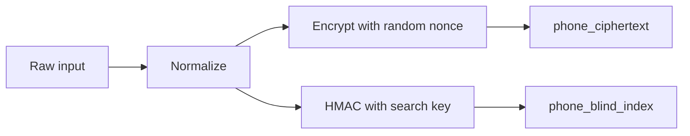

Encrypting a database column is easy until the product needs to search it.

That is where the architecture gets interesting.

If an application stores phone numbers, emails, national identifiers, or other personally identifiable information, the first instinct is reasonable: do not keep that data as plaintext in PostgreSQL. Encrypt it before writing it. Decrypt it only when the backend has a valid reason to use it.

Then a normal product requirement appears.

Support needs to find a customer by phone number. The system needs to prevent duplicates. An integration needs to match an incoming event to an existing person.

Now encrypted storage alone is not enough.

## The Wrong Boundary

One tempting answer is to move encryption to the frontend.

The browser receives the phone number, encrypts it, sends ciphertext to the backend, and the server never sees the raw value. At first glance, that sounds safer.

For a normal SaaS application, it is usually the wrong boundary.

The browser is a user experience boundary. It is not where I want to put the core cryptographic trust model unless the product is explicitly designed as Zero-Knowledge from the beginning.

The backend often needs to validate data, normalize it, enforce uniqueness, match webhooks, run background jobs, or integrate with third-party systems. If the backend cannot operate on the value at all, those features become awkward or impossible.

There is also the browser threat model. If an attacker can run JavaScript in the page through XSS, client-side encryption does not protect the plaintext the user is typing. The malicious script can read it before encryption or replace the crypto code itself.

Client-side encryption is not useless. It belongs to a different product promise.

If the product is ProtonMail, Signal, or a true Zero-Knowledge vault, the architecture starts from server blindness. Most SaaS systems are not making that promise. They need a backend that can enforce business rules while still treating sensitive data carefully.

## Deterministic Encryption Solves The Wrong Problem

Another answer is deterministic encryption.

With deterministic encryption, the same plaintext always produces the same encrypted value:

```text
encrypt("+59899123456") -> abc123
encrypt("+59899123456") -> abc123
```

That makes equality search easy. The database can look for `abc123`.

The problem is that the ciphertext has become an index.

Repeated values are now visible. An attacker with a database dump may not know the phone number immediately, but they can see which rows share the same value. For low-entropy fields like phone numbers, emails from a known customer base, country codes, or document identifiers, that leakage matters.

The system solved lookup by weakening the storage model.

That is the architectural smell: one column is being asked to store the sensitive value safely and support equality search at the same time.

Those are different responsibilities.

## Ciphertext Plus Blind Index

The pattern I prefer here is a blind index.

Instead of making the ciphertext searchable, the application stores two separate values:



The encrypted column owns confidentiality. The blind index owns exact lookup.

The ciphertext should use authenticated encryption with a fresh random nonce or IV for every write. The same phone number should not produce the same ciphertext twice.

The blind index should be derived from the normalized plaintext using a keyed hash, commonly HMAC-SHA-256. The database gets a stable value it can index, but it does not get the plaintext.

The table shape becomes simple:

```text
customers
  id
  phone_ciphertext
  phone_blind_index
  email_ciphertext
  email_blind_index
```

The database can do an ordinary indexed equality query. It just searches on a keyed search token instead of the original value.

## Normalization Is Not A UI Detail

The quiet detail that makes or breaks this pattern is normalization.

Users do not type phone numbers consistently:

```text
099 123 456
099123456
+598 99 123 456
+59899123456
```

Those may all represent the same phone number.

If the application computes the HMAC over raw input, each format produces a different blind index. The lookup becomes technically correct and practically useless.

The backend needs one canonical form before hashing:

```text
normalizePhone("099 123 456")     -> "+59899123456"
normalizePhone("+598 99 123 456") -> "+59899123456"
```

Only then should it calculate the blind index.

That makes normalization part of the data model, not a frontend convenience. The same rule must run when creating a record, updating a record, and searching for a record.

If those paths drift, the index stops being trustworthy.

## Write And Search Flow

On write, the backend should:

1. Validate the input.
2. Normalize it.
3. Encrypt the normalized value with a random nonce.
4. Compute the blind index with a separate HMAC key.
5. Store both values.

Conceptually:

```text
input_phone = "099 123 456"

normalized_phone = normalizePhone(input_phone)
phone_ciphertext = encryptWithRandomNonce(normalized_phone, encryption_key)
phone_blind_index = hmacSha256(normalized_phone, blind_index_key)
```

On search, the backend mirrors the same path:

1. Validate the search input.
2. Normalize it with the same rule.
3. Compute the blind index.
4. Query the indexed column.
5. Decrypt only matched rows the caller is allowed to see.

The SQL stays boring:

```sql
select *
from customers
where phone_blind_index = $1;
```

The interesting part is what `$1` represents. It is not the phone number. It is not deterministic ciphertext. It is a keyed lookup token derived from the normalized value.

## What Leaks, And What Does Not

Blind indexing improves the failure mode of a database leak.

An attacker who only gets the database does not see raw phone numbers or emails. The sensitive values are encrypted with random nonces, so the ciphertext column does not reveal repeated plaintext values. The blind index also resists a simple offline dictionary attack better than an unkeyed hash, because guesses require the HMAC key.

But blind indexes are not magic.

They still reveal equality. If two rows have the same normalized phone number, they will have the same blind index. That is the tradeoff that makes exact search possible.

The goal is not zero leakage. The goal is controlled leakage.

This pattern also does not protect you if an attacker gets both the database and the application keys. That is why key management is part of the architecture, not a deployment footnote. Encryption keys and blind index keys should be separate, access should be limited, rotation should be planned, and logs should not capture plaintext, normalized values, ciphertexts, or search tokens accidentally.

The code can implement the pattern correctly and the system can still fail operationally.

## The Real Sacrifice Is Partial Search

Blind indexes are good for exact matches:

```text
Find the customer whose normalized phone is +59899123456.
```

They are not good for arbitrary substring search:

```text
Find every customer whose phone contains 123.
```

A normal `LIKE '%123%'` query needs the database to inspect the value. If the value is encrypted, the database cannot do that.

You can design derived indexes for prefixes, suffixes, n-grams, or last digits. Sometimes that is valid. But every additional index leaks more structure. A prefix index reveals shared prefixes. An n-gram index reveals more of the value. A last-four-digits index reveals the last four digits.

That tradeoff should be explicit.

The better question is not, "Can we support partial search?"

It is, "What exact search behavior does the product need, and what leakage are we accepting to support it?"

## Tests That Protect The Promise

The tests around this pattern should protect behavior, not crypto internals.

I would want coverage for these guarantees:

1. Equivalent input formats normalize to the same value.
2. The same normalized value produces the same blind index.
3. The same normalized value produces different ciphertexts across writes.
4. Searching by an equivalent format finds the existing record.
5. Updating the sensitive field updates both ciphertext and blind index.
6. Logs and API responses do not expose normalized plaintext or blind indexes.

The third test matters a lot.

If two encryptions of the same value produce the same ciphertext, the implementation has drifted toward deterministic storage. That is exactly what this design is trying to avoid.

The blind index should be deterministic. The ciphertext should not be.

## The Practical Checklist

For exact search over encrypted PII in a SaaS backend:

1. Define the exact search behavior the product needs.
2. Normalize inputs before both encryption and indexing.
3. Use non-deterministic authenticated encryption for storage.
4. Use keyed HMAC for lookup.
5. Keep encryption keys and blind index keys separate.
6. Store ciphertext and blind index in separate columns.
7. Add a normal database index on the blind index column.
8. Treat partial search as a separate design, not a free feature.

None of this replaces authorization, audit trails, secret management, or operational discipline.

The pattern gives you a safer data model. It does not make the surrounding system safe by itself.

## The Bigger Lesson

The lesson is not "use HMAC."

The lesson is to stop asking one database column to own two conflicting responsibilities.

Encrypted storage and searchable lookup are different jobs. Blind indexing works because it makes that separation explicit.

The ciphertext can be optimized for confidentiality. The blind index can be optimized for exact lookup. The backend can own normalization and key access. The database can do what it is good at: indexed equality queries.

That is the architectural shape I want in a normal SaaS application.

Not frontend crypto pretending the server is blind.

Not deterministic encryption pretending equality leakage is free.

Just a clear boundary: protect the sensitive value, derive the minimum search token the product needs, and be honest about the tradeoff you accepted.
