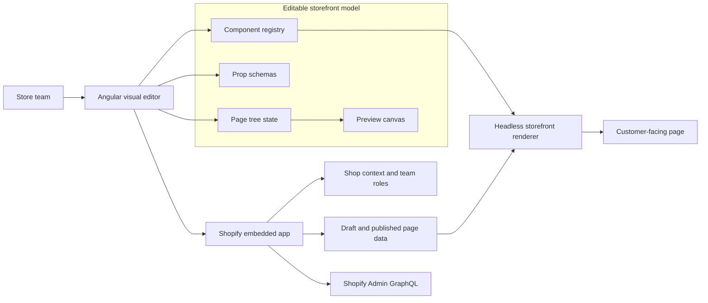

Headless e-commerce gives developers a lot of freedom.

It also takes something away from the people who operate the store every day.

Marketing and content teams are used to visual tools. They want to change sections, preview pages, adjust content, and publish without waiting for a developer to touch a repository. When a storefront moves to a custom headless architecture, that autonomy often disappears.

Kustomizer started from that tension.

The goal was not to build a page builder for the sake of building a page builder. The goal was to preserve the engineering advantages of a headless storefront while giving non-technical teams a credible editing workflow again.

## The Product Boundary

The easy version of this problem is a generic drag-and-drop editor.

The more interesting version is a system where developers still own the components, performance model, data boundaries, and storefront architecture, while business users can safely assemble and edit pages.

That boundary shaped the project.

Kustomizer was designed around three pieces:

- an Angular visual editor for editing page structure and component props
- a storefront renderer that can turn saved content into real pages
- a Shopify embedded app backend that connects editing workflows to shop context and platform storage

The editor is not trying to make every possible website editable. It is trying to make a known set of storefront components configurable, previewable, and publishable.

That difference matters.

When the editable surface is explicit, developers can define what a section supports, what props are valid, where children can be nested, and how rendering should behave. The product gains flexibility without giving up control of the system.

## What The Engineering Had To Prove

A visual editor looks like a UI problem, but the credibility comes from the state model.

The project needed to support:

- component registration and reusable prop schemas
- nested sections and blocks
- selection state, movement, and editing interactions
- undo and redo
- dirty state and publish/save flows
- preview behavior that feels close to the final storefront

Those details are not decorative. They determine whether the tool feels safe.

If users cannot trust preview, they will not publish. If they cannot undo, they will hesitate. If the system allows invalid component structures, developers inherit a support problem. If publishing is unclear, the tool becomes risky instead of empowering.

That is the systems story behind the UI.

## Shopify As The Integration Constraint

The Shopify side forced a second boundary: where should page content live, and how should a custom editor behave inside the commerce platform?

The embedded app layer handled shop context, API routes, page operations, published and draft state, team access, and Shopify GraphQL proxying. Page content could be stored through Shopify metafields, keeping the commerce platform involved instead of turning Kustomizer into a disconnected CMS.

That decision is a tradeoff.

It means accepting Shopify platform limits, authentication complexity, and embedded-app constraints. But it also keeps the editing model closer to where the store already lives.

For a product like this, integration design is product design.

## What This Project Shows About My Engineering

Kustomizer is one of the clearest examples of how I like to work because it combines product validation, frontend architecture, backend integration, and delivery discipline.

The project was not only technical execution. It also involved validating the problem with store owners, developers, and commercial profiles; narrowing scope; justifying the architecture; and thinking about what a production-oriented first version should include.

The strongest engineering signal is not that I used Angular or Shopify.

The signal is that I can take an ambiguous product pain, separate user autonomy from developer control, and build a system around that boundary.

## The Bigger Lesson

Good product engineering is often about returning autonomy without removing guardrails.

In Kustomizer, non-technical users needed freedom. Developers needed control. The architecture had to respect both.

That is the part I would carry into any SaaS product: the best tools are not the ones that expose everything. They are the ones that make the safe path powerful enough.
