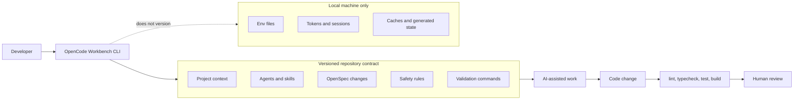

AI-assisted development gets messy when the workflow lives only on one developer's machine.

One person has useful agents. Another has a different set of prompts. Someone remembers to run the right validation. Someone else asks the model to edit code without the architecture context that made the previous change safe.

Nothing about that fails loudly.

The repo still builds. The process just becomes invisible.

OpenCode Workbench is my attempt to make that process visible, repeatable, and reviewable.

## The Problem With Personal AI Setup

Personal AI configuration is useful until a repository starts depending on it.

If agent instructions, commands, safety rules, and project context are only local, then the workflow cannot be reviewed like the rest of the engineering system. New contributors have to reconstruct it. Existing contributors drift. The team loses consistency.

The framing behind OpenCode Workbench is simple:

- shared behavior belongs in versioned files
- local identity and secrets stay local
- larger changes should move through explicit specs
- validation should be part of the workflow, not a suggestion after the fact

That framing turns AI usage from personal productivity into repository governance.

## The CLI As A Delivery Mechanism

OpenCode Workbench is a published TypeScript CLI, not just a copied folder of prompts.

That matters because installation is part of the product.

The CLI can bootstrap a repository, add workflow pieces, run audits, execute monorepo-aware tasks, diagnose setup problems, and uninstall what it created. It also has to handle real-world adoption concerns: collisions, backups, dry runs, and predictable behavior when files already exist.

Those details are boring in the best way.

They are what make a tool safe enough to try.

## What The Workflow Standardizes

The workbench standardizes the parts of AI-assisted development that should not depend on memory:

- project context files
- OpenSpec proposal and task conventions
- reusable agents and skills
- safety defaults and guardrails
- repo audits for documentation drift
- task runners for lint, typecheck, test, and build workflows

The goal is not to replace engineering judgment.

It is to reduce the number of times a developer has to remember the same operational rules manually.

An agent should know the repo's architecture expectations. A larger change should have a proposal. A generated edit should be validated. A team should be able to see how the workflow is supposed to behave by reading files in the repository.

## What This Project Shows About My Engineering

OpenCode Workbench is developer tooling, but the deeper theme is systems thinking.

I care about the process around code: how changes are proposed, how context is shared, how risk is reduced, and how teams keep quality from depending on heroics.

Building the CLI forced me to think about product ergonomics, file-system safety, package publishing, monorepo detection, task execution, and documentation as an interface.

The strongest signal is not that the project uses TypeScript and Commander.

The signal is that I can turn a messy local workflow into a small product with explicit boundaries.

## The Bigger Lesson

AI-assisted engineering needs boring infrastructure.

Prompts are not enough. Agents are not enough. The useful work starts when the repository defines what good assistance looks like, what files belong in git, what stays local, and how changes are verified.

That is what OpenCode Workbench is trying to make easier: not faster code at any cost, but safer speed.
