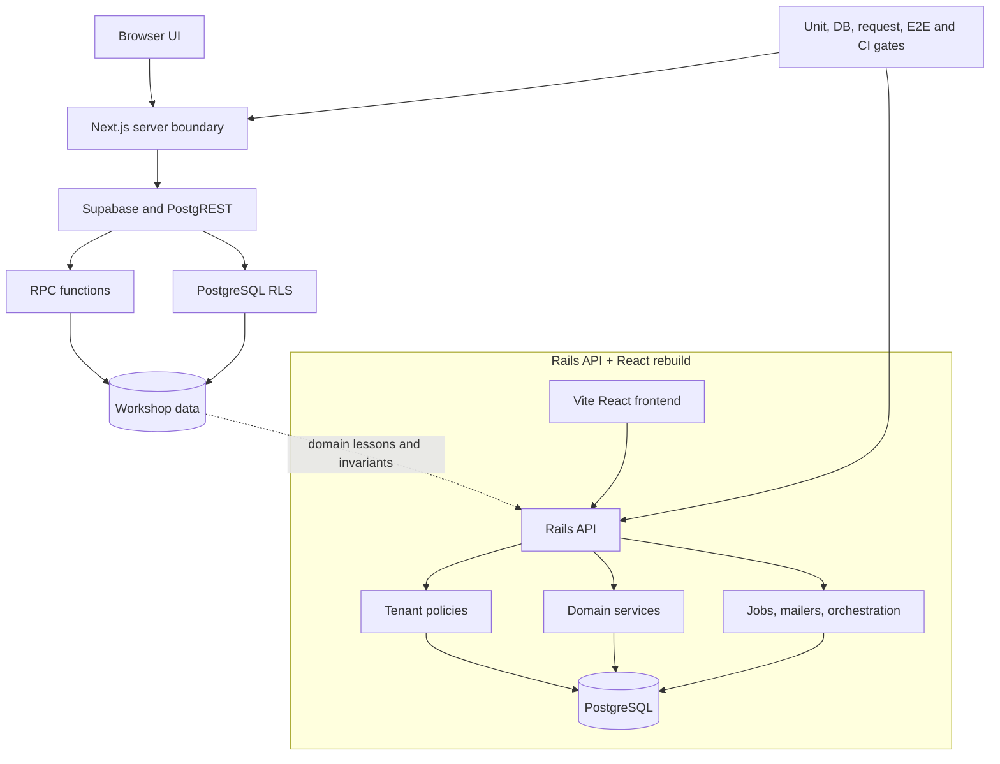

Sistema Taller began as a practical product problem: manage the operational flow of an automotive workshop with enough traceability to be useful.

Customers. Vehicles. Work orders. Reception. Histories. Corrections. Print views. The domain is not glamorous, but it is exactly the kind of software where correctness matters because people use it to run a real workflow.

The project became more interesting when the architecture had to carry the same seriousness as the product.

## The First Architecture: Database-Enforced Trust

The first version used Next.js, Supabase, PostgreSQL, RPC functions, and Row Level Security.

That architecture pushed authorization close to the data. Tenant access, membership rules, grants, technical roles, and fail-closed behavior were not treated as UI conditions. They were part of the database contract.

That shaped the way I thought about the system:

- the browser is not trusted
- server code should not casually bypass tenant rules
- database functions need clear authority boundaries
- negative tests are as important as happy-path tests
- local verification should exercise real PostgreSQL behavior where mocks would lie

The strongest learning from that version was not Supabase itself. It was learning to model authority across the Browser → Next.js → Supabase/PostgREST → PostgreSQL chain.

## Why Rebuild It

The second version moved toward a Rails API plus a Vite/React frontend.

That was not a rewrite for novelty.

It was an architectural pivot.

Rails made sense when the product needed a more conventional backend application layer: service objects, policies, mailers, jobs, orchestration, request specs, and a deployment path that could grow with the product.

The domain knowledge from the first version still mattered. Customers, vehicles, work orders, histories, memberships, audit events, and tenant boundaries did not disappear. The question became where those responsibilities should live in the new architecture.

## What The Rebuild Emphasized

The Rails version gave the backend a clearer place to express product behavior:

- tenant-scoped domain models
- service and policy layers
- request and service-oriented tests
- audit events and operational traceability
- frontend/backend separation
- CI gates for backend verification and frontend lint/build

This made the product easier to reason about as an application, not only as a set of database rules.

That does not mean the first architecture was wrong. It means the product taught me what it needed next.

Good engineering sometimes means changing architecture after learning more about the domain.

## What This Project Shows About My Engineering

Sistema Taller is a strong signal because it shows how I approach serious product foundations.

I care about authorization, data integrity, test strategy, and local reproducibility. I do not want business-critical behavior to depend only on frontend conditions or developer memory. I want the system to make invalid states hard to create and risky changes hard to merge unnoticed.

It also shows that I can compare architectures without turning the decision into a framework debate.

Next.js/Supabase/RLS taught one set of lessons. Rails API/React taught another. The value is in knowing why the boundary moved.

## The Bigger Lesson

Architecture is not a stack list.

It is a map of responsibility.

Sistema Taller forced that map to be explicit: what belongs in the database, what belongs in the backend, what belongs in the frontend, and what must be verified continuously.

That is the kind of engineering maturity I want the project to show. Not perfection. Better boundaries after real learning.
