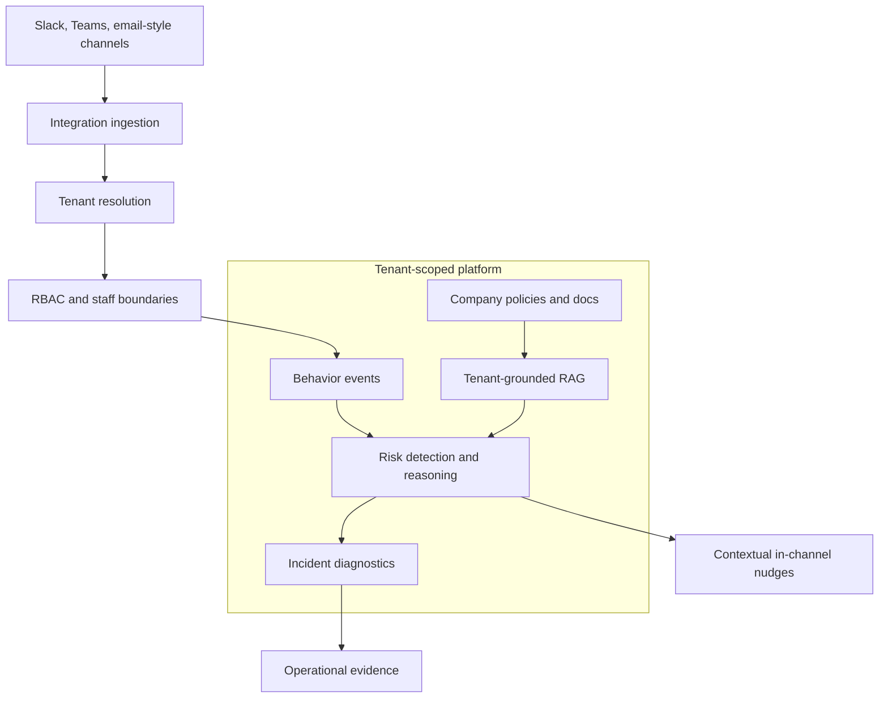

Security products can become noisy very quickly.

That is especially true when the product watches communication channels. A team does not need another dashboard full of generic alerts. It needs help at the moment where risky behavior appears, in the place where work is already happening, with enough context to make the intervention useful.

URadar is the project where I have been thinking hardest about that boundary.

The product direction is agentic social intelligence for workspace security. Instead of starting from simulated training campaigns, the platform is shaped around real collaboration behavior: what people share, how risk appears in context, and how the system can intervene without turning every message into noise.

## The Hard Part Is Not The AI Call

It is tempting to describe a project like this as an AI system.

That is only partially true.

The interesting engineering work is the platform around the AI:

- tenant isolation
- RBAC and staff boundaries
- collaboration-channel integrations
- tenant-specific knowledge grounding
- diagnostics and evidence
- operational workflows that do not overwhelm users

An agentic feature is only useful if the surrounding system knows whose data it is allowed to use, which organization owns the context, what policy should ground the response, and what action is safe to take.

That is why the architecture matters more than the model demo.

## Multi-Tenant Trust As A Product Requirement

For URadar, multi-tenancy is not just a database concern.

It is a product promise.

Organizations need confidence that their policies, internal documents, diagnostics, and communication data stay inside the correct tenant boundary. MSP and reseller-style operations add another layer: the system may need to support operators who manage multiple organizations without flattening access control.

That turns authorization into a design constraint from the beginning.

The backend has to resolve tenant context deliberately. Roles need predictable defaults. Staff access needs explicit boundaries. AI grounding needs to pull from the right knowledge base, not the most convenient one.

Failing that boundary would not be a small bug. It would be a trust failure.

## Integrations Are Where Reality Enters

The product becomes real when it touches the channels where people actually work.

Slack, Teams, and email-style integrations are not just API adapters. They bring different identity models, event shapes, permissions, delivery guarantees, and operational edge cases.

That makes integration work a backend design problem:

- normalize incoming events without losing useful context
- process messages asynchronously when needed
- avoid duplicating detection logic per channel
- store only what the system has a reason to store
- keep diagnostics useful without exposing more than necessary

The value of the integration is not that a webhook fires. The value is that the product can reason over collaboration behavior in a way that remains tenant-aware and operationally explainable.

## What This Project Shows About My Engineering

URadar is ownership work.

My role is closest to technical lead: shaping architecture, delivery practices, product boundaries, and the path from implementation work toward a real business.

It has pushed me to work across backend systems, full-stack product decisions, AWS delivery concerns, AI/RAG architecture, identity, authorization, and quality. It has also forced me to keep asking the question that matters in security software: what does the system actually protect, and what does it only make easier?

That question keeps the work honest.

## The Bigger Lesson

Agentic products do not become serious because they call a model.

They become serious when the platform around the model is reliable enough to earn trust.

For URadar, that means tenant boundaries, grounded context, careful integrations, and interventions that respect how teams actually work. That is the kind of engineering problem I want more of: product-shaped, security-sensitive, and technically deep enough that shortcuts show up quickly.
