The problem was simple: classes were on Vimeo, and I wanted clean text transcripts for studying.

The implementation was not simple.

Private showcases, browser-only access, media manifests, audio reconstruction, long-running transcription, partial failures, and repeated runs all turn a small script into a real automation pipeline.

Vimeo Transcriber is one of those projects that looks narrow from the outside and teaches a lot about reliability from the inside.

## The Real Requirement Was Resumability

A throwaway script can download one video and call a transcription model.

That was not enough here.

The useful version needed to:

- detect new videos instead of reprocessing old ones
- use a persistent browser session for private showcase access
- capture playable media information from the page
- download audio segments reliably
- reconstruct and convert media with ffmpeg
- transcribe long audio with Whisper
- checkpoint progress so a failed run could continue
- write one clean text output per class

```mermaid
flowchart LR
  Schedule["Run pipeline"] --> History["Check processed-video history"]
  History --> Browser["Playwright persistent browser"]
  Browser --> Showcase["Private Vimeo showcase"]
  Showcase --> Manifest["Capture media manifest"]
  Manifest --> Segments["Download audio segments"]
  Segments --> FFMPEG["Reconstruct and convert with ffmpeg"]
  FFMPEG --> Chunks["Split audio into chunks"]
  Chunks --> Whisper["Whisper transcription"]
  Whisper --> Checkpoints["Partial transcripts and checkpoints"]
  Checkpoints --> Output["One clean transcript per class"]
  Output --> History
```

That list changes the shape of the project.

The code is no longer only about calling a model. It is about surviving interruption.

## Browser Automation As An Integration Layer

The project used Playwright because the normal direct-download path was not reliable for the private-showcase workflow.

That made the browser part of the integration layer.

Instead of pretending there was a clean API for the job, the automation had to observe what the real player loaded, capture manifests, and use the authenticated browser context that already had access.

This kind of automation requires a different mindset from normal backend integration work.

The page is not a stable contract. Network behavior can change. A selector can break. A manifest can be different from the previous class. The system needs enough fallback behavior and diagnostics that the next failure is understandable.

## Whisper Is Only One Step

Transcription was the final visible output, but Whisper was only one stage in the pipeline.

Before transcription, the system had to find the video, download the right media, filter subtitles/manifests when needed, reconstruct audio, and convert it to the expected format.

During transcription, it had to split work into chunks, keep partial progress, and resume without throwing away completed effort.

After transcription, it had to produce text files that were useful for studying and downstream tools.

The lesson is that AI features often depend on unglamorous pipeline engineering.

The model is the part people notice. The surrounding reliability is the part that makes the output exist.

## What This Project Shows About My Engineering

Vimeo Transcriber shows a different side of my profile.

It is not a SaaS backend or a product UI. It is practical automation: understanding a messy workflow, decomposing it into steps, handling external system behavior, and building idempotency so repeated runs are safe.

It also reflects how I learn. I built the tool because I needed better study material, but I treated the implementation like an engineering problem instead of a one-off hack.

That is a pattern I value: if a repetitive workflow is painful, automate it carefully enough that it can be trusted.

## The Bigger Lesson

Good automation is not the happy path.

Good automation is what happens after the first failure.

Can it resume? Can it avoid duplicates? Can it explain what went wrong? Can it preserve partial progress? Can it run again without making a mess?

Vimeo Transcriber matters because it answers those questions in a small, concrete domain. That same instinct applies to bigger systems too.
